# Lab 02 - *Pixels*, Imagem, Cores e *Shaders*

## Objetivos:

1. Reforçar os conceitos básicos de imagens digitais e *pixels*; 
2. Utilizar os diferentes sistemas de representação de cores no contexto de aplicações gráficas;
2. Mostrar como se dá a geração de imagens a partir de *shaders*;
3. Utilizar os conceitos vistos em aula em exercícios práticos. 

## Lembrando mais uma vez...

É preciso:

1. Baixar o repositório [*Assets*](https://github.com/aapolinariojr/Assets) na máquina local;
2. Ter a extensão [*Live-server*](https://marketplace.visualstudio.com/items?itemName=ritwickdey.LiveServer) instalada no [Visual Studio Code -VSCode](https://code.visualstudio.com/docs/setup/setup-overview?originUrl=%2Fdocs);
3. Mapear o diretório *Assets* pelo *Live-Server* ou localizado dentro do diretório raiz do *web-server*.

Veja o Lab 01 para maiores detalhes.

## Antes de começar:

Para rodar os *shaders* desse Lab voce deve instalar no **VS Code** a extensão [**Shader Toy extension**](https://marketplace.visualstudio.com/items?itemName=stevensona.shader-toy) by stevensona.

Analise com cuidado os códigos fornecidos nesse Laboratório. 

Consulte [1] para entender como funcionam os sistemas de cores **RGB** e **HSL**; 

Em [3] voce encontra um resumo do objeto *Color* e com as cores são representadas no *Three.JS*;

## Exercícios:

1. Crie um novo *shader* que gere um padrão de cores semelhante ao da Figura 1. Crie novos padrões de cores utilizando as [palettes](https://iquilezles.org/articles/palettes/)

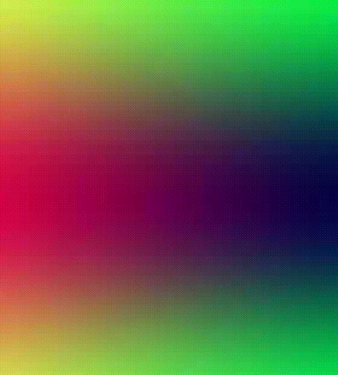

*Figura 1 - Padrão de cores muda ao longo do espaço 2D e do tempo.*

2. Codifique um *shader* que crie um padrão de cores como o da Figura 2, onde cada quadrante possui uma cor distinta.

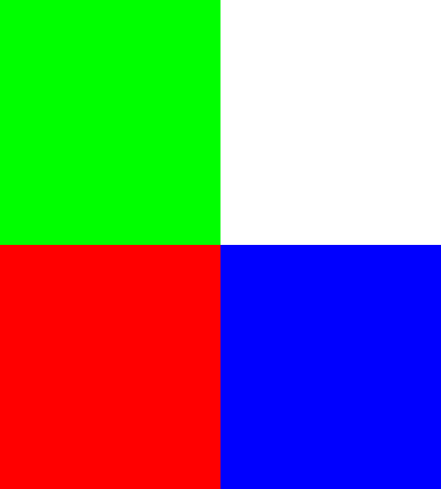  

*Figura 2 - Cada quadrante do espaço 2D possui uma cor distinta.*

3. Modifique o *shader* do exercício anterior para criar padrões de suavização como os da Figura 3. 

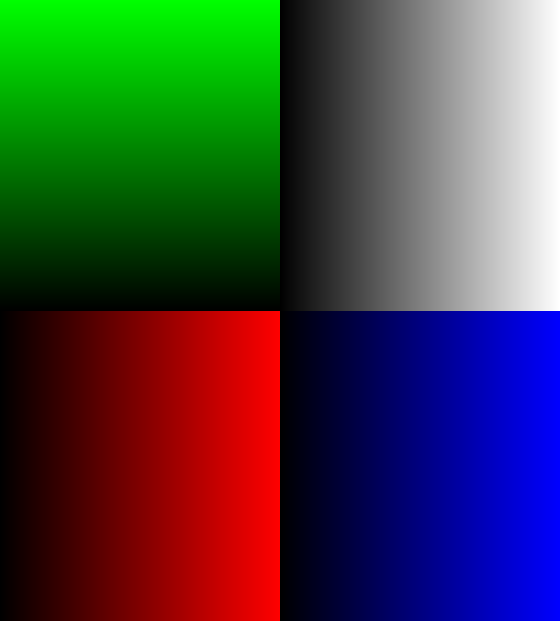  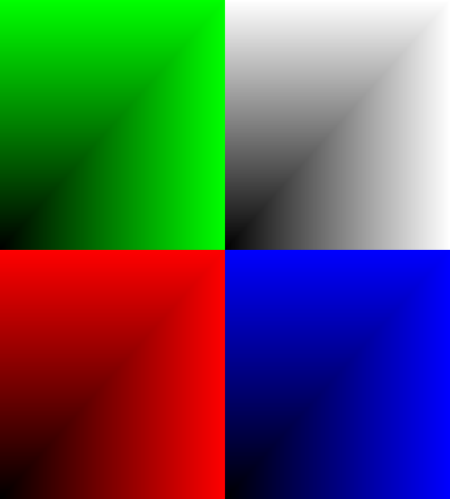

*Figura 3 - Quadrantes com padrões de suavização.*

4. Codifique um *shader* que desenhe uma reta, a partir da identificação das regiões acima e abaixo da reta, como mostra a Figura 4. Parametrize a equação da reta de modo que qualquer reta possa ser visualizada. Cuidado com casos particulares.

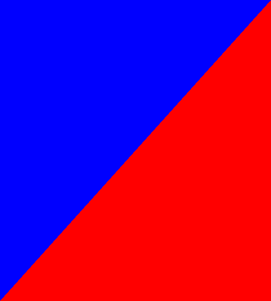 

*Figura 4 - Uma reta onde os pontos abaixo da reta são vermelhos e os acima são azuis.*

5. Desenvolva um *shader* para desenhar um circulo com da Figura 5 à esquerda. Depois modifique esse *shader* para que ele possa destacar os pontos na fronteira do circulo, como mostra a Figura 2 à direita. 

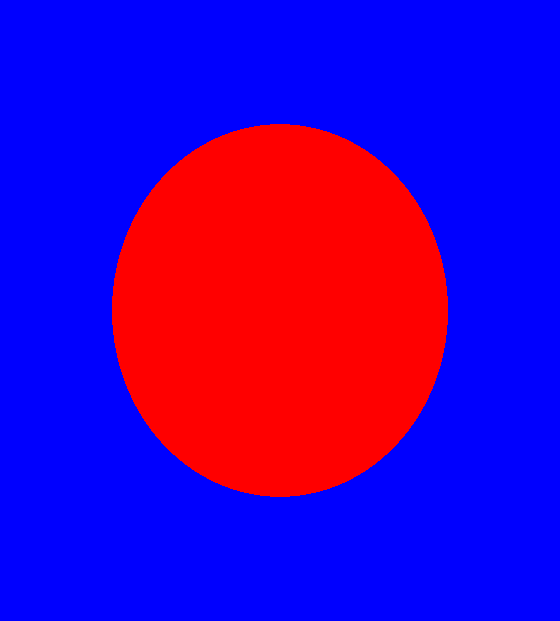 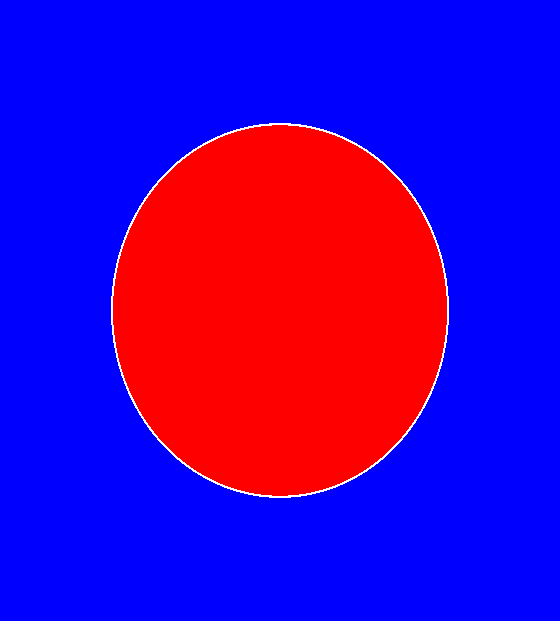

*Figura 5 - Um circulo onde os pontos internos são vermelhos e os externos azuis (à esquerda) e com destaque da borda em branco (à direita).*

6. Para definir um circulo "clássico" utilizamos a métrica **Euclidiana** para medir a distancia dos pontos do espaço 2D ao centro do circulo. Outras métricas podem ser utilizadas, gerando formas diferentes. Pesquise que sobre as métricas [Manhattan](https://en.wikipedia.org/wiki/Taxicab_geometry), [Chebyshev](https://en.wikipedia.org/wiki/Chebyshev_distance) e [Minkowski](https://en.wikipedia.org/wiki/Minkowski_distance) e aplicando-as gere as formas da Figura 6.  

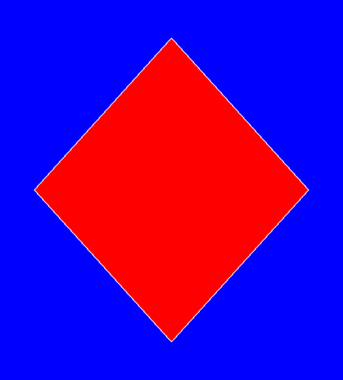 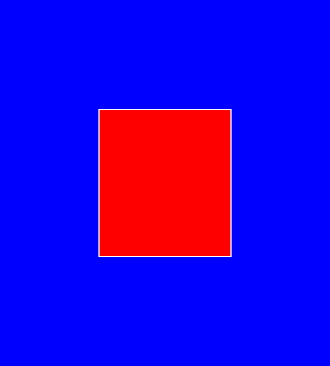 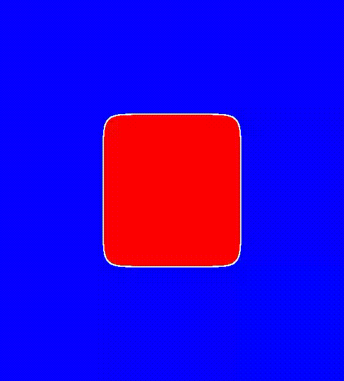

*Figura 6 - Um círculo definido pelas métricas de distância Manhattan, Chebyshev e Minkowski*

7. Crie um *shader* capaz de desenhar um circulo variando seu tamanho ou posição ao longo do tempo, como os exemplos da Figura 7.  

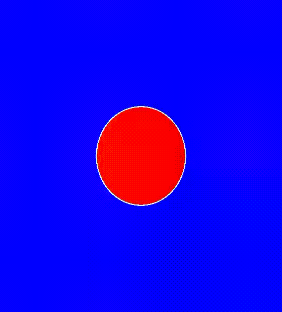 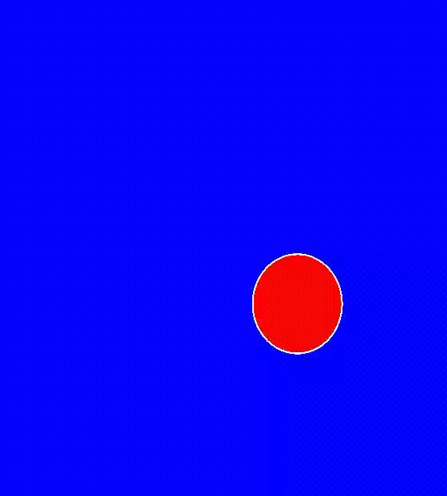 

*Figura 7 - Um círculo com raio (à esquerda) e posição (à direita) variando no tempo.*

8. Desenvolva um *shader* capaz de mapear as cores do sistema [HSL](https://en.wikipedia.org/wiki/HSL_and_HSV) no plano 2D e em um círculo, como mostra a Figura 8. 

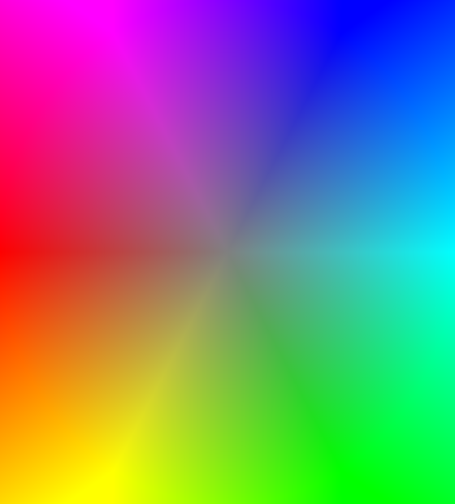 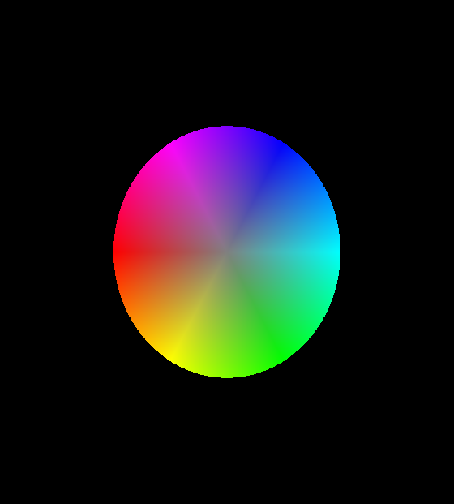 

*Figura 8 - Cores do sistema HSL visualizadas em um quadrado e em um círculo.*

9. Crie um *shader* que permita mostrar, na mesma tela, uma imagem original e seus 3 canais de cor. .

10. Altere o *shader* do exercicio anterior para mostrar uma imagem com seus 3 canais de cor porém agora representados no sistema HSL[4]. 

11. Desenvolva um *shader* que aplique a **transformação de binarização** em uma imagem. 

12. Crie um *shader* que aplique a **transformação negativa** em uma imagem. Experimente aplicar essa transformação em cada canal de cor separadamente e simultaneamente. Utilize o mecanismo de animação apresentado no exemplo *02-Cores* para facilitar a analise dos resultados. 

13. Desenvolva *shaders* para aplicar as **transformações log e gama** nos canais de cor de uma imagem. Teste o que ocorre com as imagens quando essas transformações são aplicadas em canais de cores RGB independentes ou conjugados. 

14. Modifique o exercício anterior para que as transformações sejam aplicadas apenas no canal de luminosidade da imagem (considerando sua representação em HSL). Após a transformação o valor do pixel deve ser convertido novamente para a representação RGB [4] para ser apresentado. 

15. A partir do exemplo *12-filtragem-espacial* experimente modificar os pesos para criar *kernels* relacionados com outras operações abordadas em sala de aula.   

## Referências:

[1] MARSCHNER, Steve; SHIRLEY, Peter. **Fundamentals of Computer Graphics**. 5th Edition CRC Press, 2021.

[2] Dirksen, J., **Learn Three.JS: Program 3D animations and visualizations for the web with JavaScript and WebGL**. 4th Edition, Packt Publishing, 2023.

[3] **Color**. https://threejs.org/docs/?q=color#api/en/math/Color 

[4] tayloia, **RGB to HSV/HSL**. 2018. https://www.shadertoy.com/view/4dKcWK.

[5] Adam Stevenson, **Visual Studio Code - Shader Toy**. https://github.com/stevensona/shader-toy
